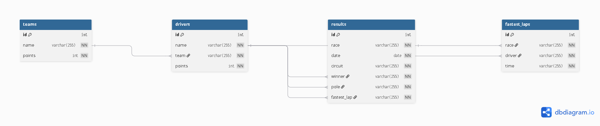

# F1
Evidence F1 (Sportovních) výsledku 
Zápisy výsledků, tabulky, statistiky. 

Zápisy vysledku:
Nazev GP
datum
Okruh
Vysledky zavodu
Kvalifikace

Tabulky:
Pruběžné pořadí šampionatu jezdcu
Pruběžné pořadí týmu
body se sčítají podle vyledku zavodu
tabulka nejrychlejších kol

Statistiky:
Kolik zavodu kdo vyhral
nejčastější umístění jednotlivých jezdcu
pruměrně bodové zisky
porovnaní tymu
vyvoj pořadí v pruběhu sezony

LOKALNĚ

pro přihlašeni pro admina (pro změnu dat) admin/admin
pro přihlašeni pro správce databaze databasemaster/databasemaster
pro přihlašeni pro super admina (muže přidavat dalši adminy) superadmin/superadmin

Udaje jsou přes iframe pro originalni vysledky, přes admina se mužou měnit data dle libosti

přihlašeni normalně jde teda přes js, zadané udaje pošle do login-api.php (ten se nasledne podiva do users.json) a pokud se udaje shodují přesměruje dle usera na stranku
v momentalni chvili jsou v users jenom 4 useři, 3 které jsem psal a naslede 1 kterej jsem testoval přes ten admin panel - roblox/roblox123 -- test subject

Role Admin slouží k změne udajum na stránce
Superadmin to co admin ale muže přidavat další adminy
databasemaster se stara o databasi.

database se schovava v db.php je tam cesta k sqlite souboru¨

je to ošetřené tak že když v URL změní např na admin.php tak ho to přesměruje na login.php a musí se přihlasit

## Přihlašeni
- `admin/admin` – Zakladní správa tabulek, dokaže upravovat data, tod vše.
- `superadmin/superadmin` – Umí to co admin ale dokaže přidávat/upravovat další adminy
- `databasemaster/databasemaster` – databasemaster - Je tam jenom tlačitko na "opravu" database
  

## Hlavní části
- `index.php` – úvodní stránka
- `vysledky.php` – veřejná stránka s výsledky závodů
- `tabulky.php` – veřejná stránka se statistikami a tabulkami
- `login.php` – přihlášení administrátorů
- `admin.php` – administrace obsahu
- `database.php` – správa databáze pro roli `databasemaster`

## Backend
- `php/init_db.php` – vytvoří databázi a základní data
- `php/db.php` – připojení k SQLite databázi
- `php/login-api.php` – API přihlášení
- `php/standings.php` – data pro tabulky
- `php/results.php` – data výsledků
- `php/add_*`, `php/*_delete.php` – CRUD operace
- `php/user_store.php` – správa uživatelů

