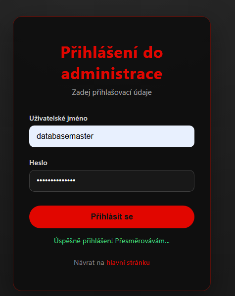
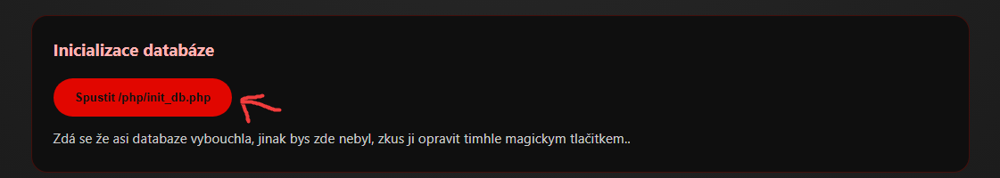
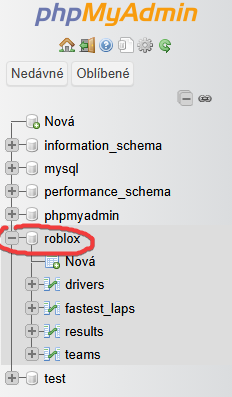
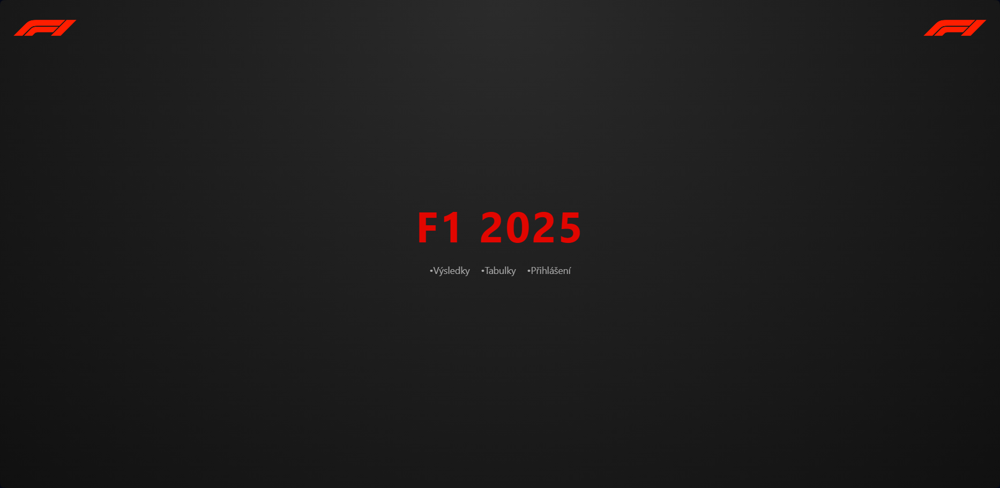
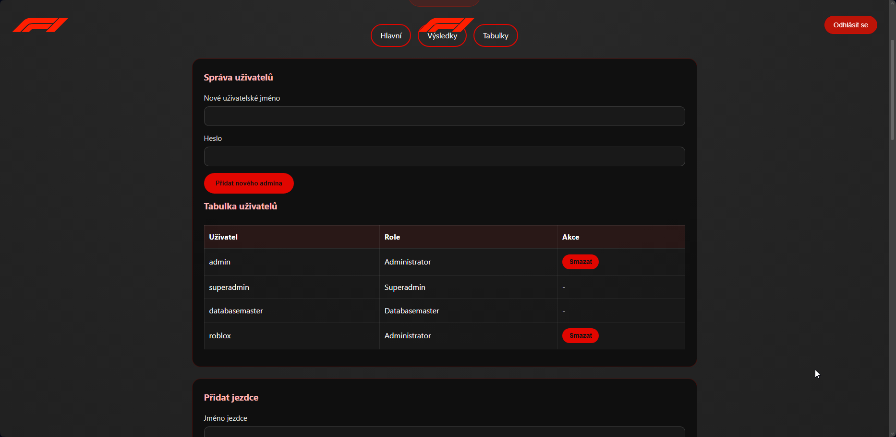

# Dokumentace projektu: F1 výsledky a statistiky

Autor: Lukáš Hudec

## Popis projektu
Tento projekt je webová aplikace pro správu výsledků a statistik Formule 1 sezóny 2025.
Aplikace je napsaná v PHP, JavaScriptu, HTML a CSS a běží lokálně pomocí XAMPP (Apache + MySQL).

Umožňuje:
- zobrazení závodních výsledků
- zobrazení průběžných tabulek jezdců, týmů a nejrychlejších kol
- správu výsledků, jezdců a týmů pro administrátory
- správu uživatelů pro superadministrátora
- správu databáze pro roli databasemaster

## Požadavky
- XAMPP (Apache + MySQL)
- PHP
- Nejlépe normalní web browser

## Spuštění
1. Spustíme užasnou aplikaci XAMPP v ní zapnem MYSQL a Apache (pokud tak neučiníme tak to nepojede a budeme smutní)
2. Zkopirujeme do ---> `C:/xampp/htdocs/`.
3. Otevřete váš užasnej web browser 1)---> `http://localhost/F1/index.php` nebo `http://localhost` a F1 pokud tam není F1 tak to není muj problem a něco jste pokazil ----> podpora.
4. Následně se přihlasíme jako databasemaster/databasemaster 
5. Po USPĚŠNÉM přihlašení jako databasemaster, klikneme na to velké tlačitko uprostřed obrazovky 
6. Pokud 5. vyšla a stranka se nezhroutila (doufam) tak se v SQL přidala nova databaze "roblox" s tabulkama atd. 
7. Pokud 6 vyšla znamená to že vyšla i 5ka tudíž jsme všichni spoko a mužeme používat aplikaci, (k upravě datum slouži admin a nebo linější metoda ig database)

> Aplikace používá MySQL databázi `roblox`, kterou vytvoří `/php/init_db.php` aka to tlačítko.

## Databáze
Databáze je MySQL a konfigurace je v souboru `php/db.php`:
- host: `127.0.0.1`
- port: `3306`
- databáze: `roblox`
- uživatel: `root`
- heslo: 

K dispozici jsou tyto tabulky:
- `drivers` – seznam jezdců
  - `id`, `name`, `team`, `points`
- `teams` – seznam týmů
  - `id`, `name`, `points`
- `fastest_laps` – nejrychlejší kola
  - `id`, `race`, `driver`, `time`
- `results` – záznamy závodů
  - `id`, `race`, `date`, `circuit`, `winner`, `pole`, `fastest_lap`

Users se nevypisují jako otroci do databaze ale sem --> `php/users.json`.
Pokud soubor neexistuje, `php/user_store.php` vytvoří výchozí uživatele.

## Výchozí uživatelské účty
- `databasemaster` / `databasemaster` – role `databasemaster`
- `admin` / `admin` – role `admin`
- `superadmin` / `superadmin` – role `superadmin`

## Role a oprávnění
- `databasemaster` – může používat stránku `database.php` pro "opravu" databáze
- `admin` – má přístup do stránky `admin.php` a může spravovat data, týmy a výsledky.
- `superadmin` – má stejné oprávnění jako admin a navíc může spravovat uživatele systému.

Stránky kontrolují session a role. Pokud uživatel není přihlášen nebo nemá oprávnění, je přesměrován na `login.php`.

## Hlavní stránky
- `index.php` – úvodní stránka aplikace
- `vysledky.php` – veřejné zobrazení výsledků závodů
- `tabulky.php` – veřejné zobrazení průběžných tabulek a statistik
- `login.php` – přihlášení do administrace
- `admin.php` – administrace výsledků, jezdců, týmů a uživatelů
- `database.php` – správa databáze pro roli `databasemaster`

## API a backend
Hlavní skripty v `php/`:
- `php/db.php` – připojení k MySQL databázi
- `php/init_db.php` – vytvoření databáze a tabulek, vložení vzorových dat
- `php/login-api.php` – ověření přihlašovacích údajů
- `php/check_auth.php` – kontrola aktuální session a role
- `php/logout.php` – odhlášení uživatele
- `php/results.php` – veřejné načtení výsledků závodů
- `php/standings.php` – načtení tabulek jezdců, týmů a nejrychlejších kol
- `php/drivers_list.php` – načtení seznamu jezdců pro administraci
- `php/teams_list.php` – načtení seznamu týmů pro administraci
- `php/results_list.php` – načtení seznamu výsledků pro administraci
- `php/add_driver.php` – přidání jezdce
- `php/driver_delete.php` – smazání jezdce
- `php/add_team.php` – přidání týmu
- `php/team_delete.php` – smazání týmu
- `php/add_result.php` – přidání výsledku závodu
- `php/result_delete.php` – smazání výsledku závodu
- `php/users_list.php` – načtení uživatelů pro superadmina
- `php/user_add.php` – přidání nového admina
- `php/user_delete.php` – smazání uživatele

## Frontend a skripty
- `Java/login.js` – odesílání přihlašovacích dat na `php/login-api.php`
- `Java/admin.js` – správa administrace: načítání dat, přidávání, mazání a správa uživatelů
- `Java/vysledky.js` – zobrazení veřejných výsledků v `vysledky.php`
- `Java/nadavka.js` – načítání statistik v `tabulky.php`

## Poznámky

- Uživatele se ukladají v `php/users.json` a ne do databaze
- `users.json` se vytvoři automaticky jestli už dávno neexistuje
- Databaze `roblox` je automaticky vytvořen přes tuto magickou věc ktera vím jak funguje `php/init_db.php`.
- `database.php` Existuje protože nevěřim že ta databaze neexploduje
- Zahadným způsobem je to ošetřené že pokud nejsem přihlašenej a zkusím jít do např admin.php tak mě to nepustí :)

## Nějaké ty fotky
### HLAVNI STRANA: 
### Vysledky:
### Tabulky:
### Z pohledu superadmina:
### Z pohledu admina sem davat nebudu protože je to to stejné jako superadmin ale více chudčí a pohled Databasemastera už vůbec. TOPSECRET.

## Závěr:
Jednoduše když už jsem si dal práci s timto dokumentem tak si ho stačí pročíst a budete všechno vědet :) pokud ne stačí se mě zeptat ale bůh snámi, radši ne.
